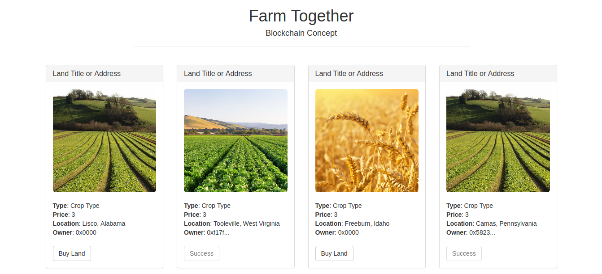

# blockchain-demo

Full stack blockchain dapp on the Ethereum platform. 
App is a proof of concept that facilitates land ownership title transfer
using the Ethereum blockchain and smart contracts. 

------

------

Requirements:

- Metamask Chrome browser extension
- Truffle
- NPM

Instance of the contract is live on the Ropsten Testnet here: 
0x9e9DbD131f8105EbdA0636fBbFf5B6862ca18829

------

Code is derived from the Truffle Petshop tutorial with modifications to the
front end and configuration to allow deployment to live and test networks.

-------

